# SafeTrack — Barangay Household Profiling System

> A Laravel-based web application for barangay-level household data management, population analytics, and emergency preparedness tracking.

---

## Table of Contents

1. [About the Project](#1-about-the-project)
2. [Tech Stack](#2-tech-stack)
3. [System Requirements](#3-system-requirements)
4. [Installation & Setup](#4-installation--setup)
5. [Running the Application](#5-running-the-application)
6. [User Roles & Access Control](#6-user-roles--access-control)
7. [Features Overview](#7-features-overview)
8. [System UI Flow Diagrams](#8-system-ui-flow-diagrams)
9. [Use Case Diagrams](#9-use-case-diagrams)
10. [Sequence Diagrams](#10-sequence-diagrams)
11. [Data Architecture Diagrams](#11-data-architecture-diagrams)
12. [API Reference](#12-api-reference)
13. [Troubleshooting](#13-troubleshooting)

---

## 1. About the Project

**SafeTrack** is a Capstone Project built as a comprehensive Barangay Household Profiling and Management System. It enables barangay officials to:

- Register and maintain household records and member demographics
- Track vulnerable population groups (PWD, seniors, pregnant, children)
- Import household data in bulk via CSV
- Generate real-time analytics and population reports
- Export data to Excel and PDF formats
- Monitor registered mobile device tokens
- Manage user accounts with role-based access control
- Receive reports from evacuation, rescue, and logistics subsystems

The system is intended for use by **Barangay Captains**, **Data Encoders**, and **Household members** in a Philippine barangay context.

---

## 2. Tech Stack

| Layer | Technology |
|---|---|
| Backend Framework | Laravel 13 (PHP 8.3+) |
| Frontend UI | Bootstrap 5 + Blade Templates |
| Database | MySQL / SQLite |
| Authentication | Laravel Sanctum |
| PDF Export | barryvdh/laravel-dompdf |
| Excel Export | maatwebsite/excel |
| Build Tool | Vite + npm |
| API Auth | Bearer Token (Sanctum) |

---

## 3. System Requirements

- PHP >= 8.3
- Composer >= 2.x
- Node.js >= 18.x and npm
- MySQL 8.0+ **or** SQLite (for local dev)
- Git

---

## 4. Installation & Setup

### Step 1 — Clone the Repository

```bash
git clone https://github.com/BlackFlame308/CapstoneProject.2.git
cd CapstoneProject.2
```

### Step 2 — Install PHP Dependencies

```bash
composer install
```

### Step 3 — Install Node Dependencies

```bash
npm install
```

### Step 4 — Configure Environment

```bash
cp .env.example .env
php artisan key:generate
```

Edit `.env` and set your database credentials:

```env
APP_NAME=SafeTrack
APP_URL=http://localhost:8000

# Use MySQL
DB_CONNECTION=mysql
DB_HOST=127.0.0.1
DB_PORT=3306
DB_DATABASE=safetrack
DB_USERNAME=root
DB_PASSWORD=your_password

# Mail (optional, for notifications)
MAIL_MAILER=smtp
MAIL_HOST=smtp.mailtrap.io
MAIL_PORT=587
MAIL_USERNAME=your_username
MAIL_PASSWORD=your_password
MAIL_FROM_ADDRESS=noreply@safetrack.local
```

### Step 5 — Run Migrations

```bash
php artisan migrate
```

> **Optional:** If you need to create `audit_logs` or `notifications` tables manually, see [DEPLOYMENT_SETUP_GUIDE.md](DEPLOYMENT_SETUP_GUIDE.md).

### Step 6 — Seed Database (Roles & Lookup Data)

```bash
php artisan db:seed
```

### Step 7 — Install Export Dependencies

```bash
composer require maatwebsite/excel barryvdh/laravel-pdf

php artisan vendor:publish --provider="Maatwebsite\Excel\ExcelServiceProvider" --tag=config
php artisan vendor:publish --provider="Barryvdh\DomPDF\ServiceProvider"
```

### Step 8 — Link Storage

```bash
php artisan storage:link
```

### Step 9 — Create the First Admin Account

```bash
php artisan tinker
```

Inside tinker:

```php
$user = \App\Models\User::create([
    'name'       => 'Captain Admin',
    'username'   => 'admin',
    'email'      => 'admin@safetrack.local',
    'password'   => bcrypt('password'),
    'role_id'    => \App\Models\Role::where('name', 'Captain')->first()->id,
    'is_active'  => true,
]);
```

---

## 5. Running the Application

### Development Mode (recommended)

Runs the Laravel server, queue worker, log watcher, and Vite dev server concurrently:

```bash
composer run dev
```

Or run each service separately:

```bash
php artisan serve          # Laravel web server on http://localhost:8000
npm run dev                # Vite for assets
php artisan queue:listen   # Queue worker (for async jobs)
```

### Production Build

```bash
npm run build
php artisan config:cache
php artisan route:cache
php artisan view:cache
```

### Access the Application

| URL | Purpose |
|---|---|
| `http://localhost:8000/` | Redirects to login |
| `http://localhost:8000/login` | Login page |
| `http://localhost:8000/admin/dashboard` | Admin dashboard |
| `http://localhost:8000/household/dashboard` | Household portal |

### Clear Cache (if needed)

```bash
php artisan cache:clear
php artisan config:clear
php artisan route:clear
php artisan view:clear
```

---

## 6. User Roles & Access Control

| Role | Description | Key Permissions |
|---|---|---|
| **Captain** (Barangay Head) | Full system administrator | Create/Read/Update/Delete all records, manage accounts, view all analytics |
| **Encoder** (Data Encoder) | Data entry operator | Create/Read/Update households and members; cannot delete; limited account access |
| **Household** | Registered household user | View own household information only; no admin access |

All admin routes (`/admin/*`) are protected by `auth` + `admin` middleware.

Role-based guards use a `role:Captain|Encoder` middleware pattern registered in `bootstrap/app.php`.

---

## 7. Features Overview

| # | Feature | Route | Status |
|---|---|---|---|
| 1 | Dashboard Analytics | `/admin/dashboard` | ✅ |
| 2 | Household Management | `/admin/households` | ✅ |
| 3 | Resident/Member Management | `/admin/residents` | ✅ |
| 4 | Account Management | `/admin/accounts` | ✅ |
| 5 | Analytics | `/admin/analytics` | ✅ |
| 6 | CSV Import Dashboard | `/admin/csv-import` | ✅ |
| 7 | CSV Bulk Upload | `/csv/upload` | ✅ |
| 8 | Device Token Tracking | `/admin/device-tokens` | ✅ |
| 9 | Advanced Search | `/admin/search` | ✅ |
| 10 | Data Export (Excel/PDF) | `/admin/export/*` | ✅ |
| 11 | Reports (Evacuation/Rescue/Logistics) | `/admin/reports/*` | ✅ (placeholder) |
| 12 | Settings & API Tokens | `/admin/settings` | ✅ |
| 13 | Household Portal | `/household/dashboard` | ✅ |

---

## 8. System UI Flow Diagrams

These diagrams describe the user journey through the system interface for each primary use case category.

---

### 8.1 Authentication Flow

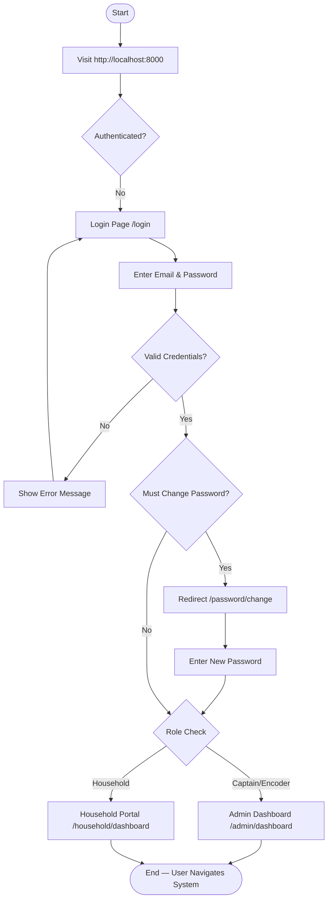
```mermaid
flowchart TD
    A([Start]) --> B[Visit http://localhost:8000]
    B --> C{Authenticated?}
    C -- No --> D[Login Page /login]
    D --> E[Enter Email & Password]
    E --> F{Valid Credentials?}
    F -- No --> G[Show Error Message]
    G --> D
    F -- Yes --> H{Must Change Password?}
    H -- Yes --> I[Redirect /password/change]
    I --> J[Enter New Password]
    J --> K{Role Check}
    H -- No --> K
    K -- Captain/Encoder --> L[Admin Dashboard /admin/dashboard]
    K -- Household --> M[Household Portal /household/dashboard]
    L --> N([End — User Navigates System])
    M --> N
```

---

### 8.2 Household Management UI Flow

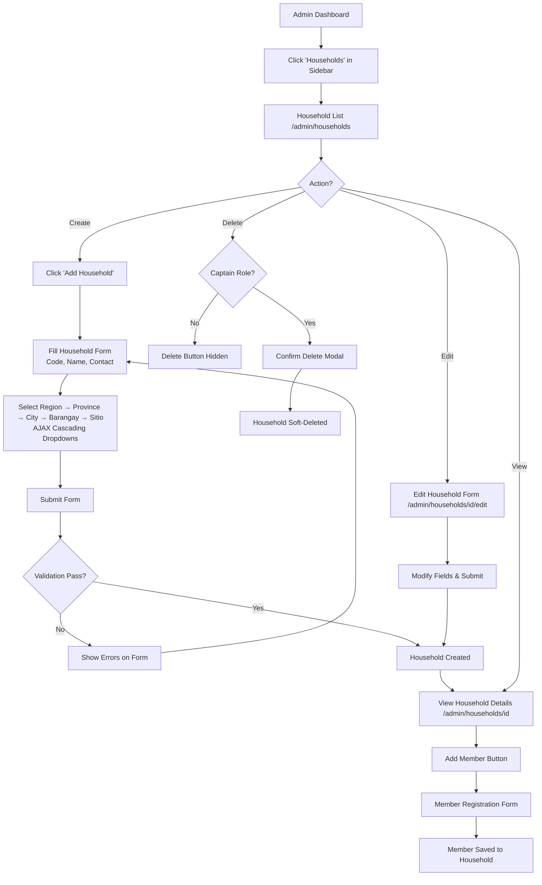
```mermaid
flowchart TD
    A[Admin Dashboard] --> B[Click 'Households' in Sidebar]
    B --> C[Household List /admin/households]
    C --> D{Action?}
    D -- Create --> E[Click 'Add Household']
    E --> F[Fill Household Form\nCode, Name, Contact]
    F --> G[Select Region → Province → City → Barangay → Sitio\nAJAX Cascading Dropdowns]
    G --> H[Submit Form]
    H --> I{Validation Pass?}
    I -- No --> J[Show Errors on Form]
    J --> F
    I -- Yes --> K[Household Created]
    K --> L[View Household Details /admin/households/id]
    D -- View --> L
    D -- Edit --> M[Edit Household Form /admin/households/id/edit]
    M --> N[Modify Fields & Submit]
    N --> K
    D -- Delete --> O{Captain Role?}
    O -- No --> P[Delete Button Hidden]
    O -- Yes --> Q[Confirm Delete Modal]
    Q --> R[Household Soft-Deleted]
    L --> S[Add Member Button]
    S --> T[Member Registration Form]
    T --> U[Member Saved to Household]
```

---

### 8.3 Member Management UI Flow

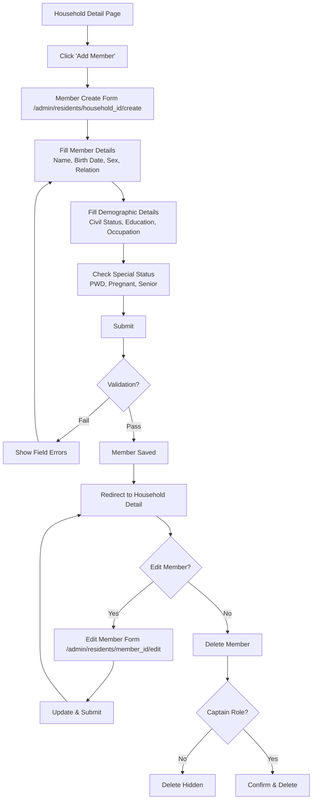
```mermaid
flowchart TD
    A[Household Detail Page] --> B[Click 'Add Member']
    B --> C[Member Create Form /admin/residents/household_id/create]
    C --> D[Fill Member Details\nName, Birth Date, Sex, Relation]
    D --> E[Fill Demographic Details\nCivil Status, Education, Occupation]
    E --> F[Check Special Status\nPWD, Pregnant, Senior]
    F --> G[Submit]
    G --> H{Validation?}
    H -- Fail --> I[Show Field Errors]
    I --> D
    H -- Pass --> J[Member Saved]
    J --> K[Redirect to Household Detail]
    K --> L{Edit Member?}
    L -- Yes --> M[Edit Member Form /admin/residents/member_id/edit]
    M --> N[Update & Submit]
    N --> K
    L -- No --> O[Delete Member]
    O --> P{Captain Role?}
    P -- No --> Q[Delete Hidden]
    P -- Yes --> R[Confirm & Delete]
```

---

### 8.4 CSV Import UI Flow

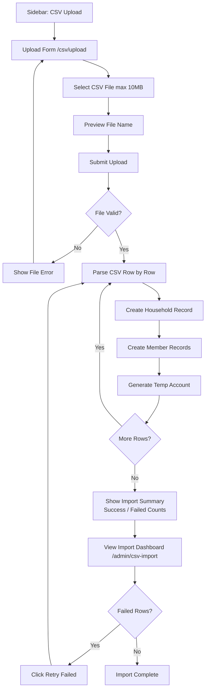
```mermaid
flowchart TD
    A[Sidebar: CSV Upload] --> B[Upload Form /csv/upload]
    B --> C[Select CSV File max 10MB]
    C --> D[Preview File Name]
    D --> E[Submit Upload]
    E --> F{File Valid?}
    F -- No --> G[Show File Error]
    G --> B
    F -- Yes --> H[Parse CSV Row by Row]
    H --> I[Create Household Record]
    I --> J[Create Member Records]
    J --> K[Generate Temp Account]
    K --> L{More Rows?}
    L -- Yes --> H
    L -- No --> M[Show Import Summary\nSuccess / Failed Counts]
    M --> N[View Import Dashboard /admin/csv-import]
    N --> O{Failed Rows?}
    O -- Yes --> P[Click Retry Failed]
    P --> H
    O -- No --> Q[Import Complete]
```

---

### 8.5 Analytics & Export UI Flow

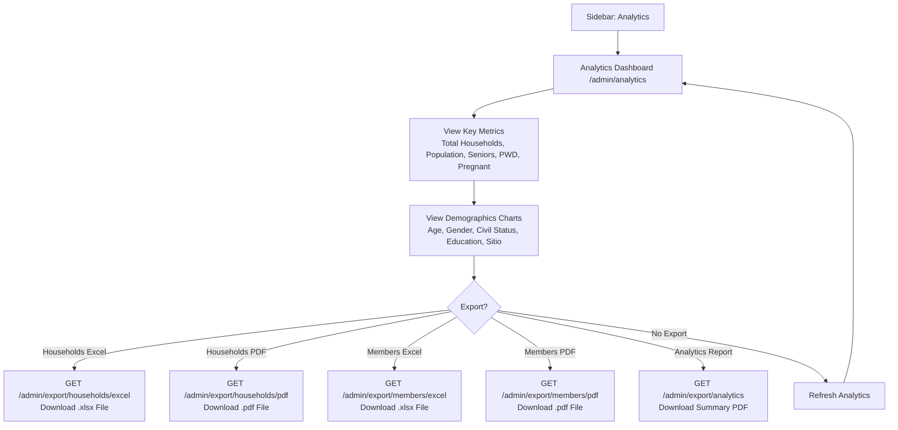
```mermaid
flowchart TD
    A[Sidebar: Analytics] --> B[Analytics Dashboard /admin/analytics]
    B --> C[View Key Metrics\nTotal Households, Population, Seniors, PWD, Pregnant]
    C --> D[View Demographics Charts\nAge, Gender, Civil Status, Education, Sitio]
    D --> E{Export?}
    E -- Households Excel --> F[GET /admin/export/households/excel\nDownload .xlsx File]
    E -- Households PDF --> G[GET /admin/export/households/pdf\nDownload .pdf File]
    E -- Members Excel --> H[GET /admin/export/members/excel\nDownload .xlsx File]
    E -- Members PDF --> I[GET /admin/export/members/pdf\nDownload .pdf File]
    E -- Analytics Report --> J[GET /admin/export/analytics\nDownload Summary PDF]
    E -- No Export --> K[Refresh Analytics]
    K --> B
```

---

### 8.6 Account Management UI Flow

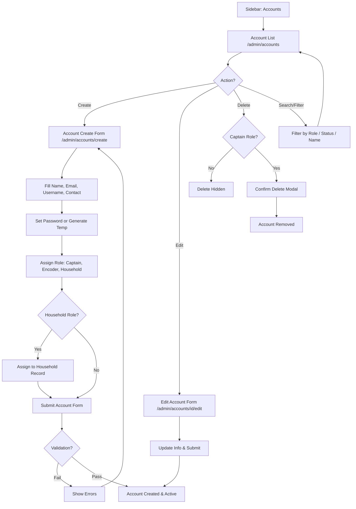
```mermaid
flowchart TD
    A[Sidebar: Accounts] --> B[Account List /admin/accounts]
    B --> C{Action?}
    C -- Create --> D[Account Create Form /admin/accounts/create]
    D --> E[Fill Name, Email, Username, Contact]
    E --> F[Set Password or Generate Temp]
    F --> G[Assign Role: Captain, Encoder, Household]
    G --> H{Household Role?}
    H -- Yes --> I[Assign to Household Record]
    H -- No --> J[Submit Account Form]
    I --> J
    J --> K{Validation?}
    K -- Fail --> L[Show Errors]
    L --> D
    K -- Pass --> M[Account Created & Active]
    C -- Edit --> N[Edit Account Form /admin/accounts/id/edit]
    N --> O[Update Info & Submit]
    O --> M
    C -- Delete --> P{Captain Role?}
    P -- No --> Q[Delete Hidden]
    P -- Yes --> R[Confirm Delete Modal]
    R --> S[Account Removed]
    C -- Search/Filter --> T[Filter by Role / Status / Name]
    T --> B
```

---

### 8.7 Advanced Search UI Flow

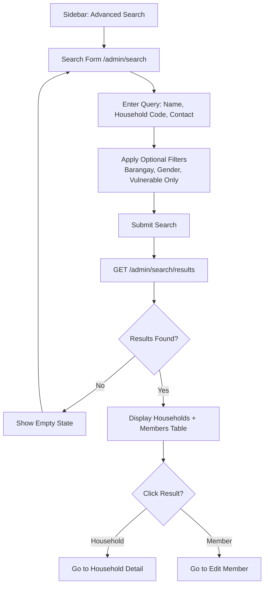
```mermaid
flowchart TD
    A[Sidebar: Advanced Search] --> B[Search Form /admin/search]
    B --> C[Enter Query: Name, Household Code, Contact]
    C --> D[Apply Optional Filters\nBarangay, Gender, Vulnerable Only]
    D --> E[Submit Search]
    E --> F[GET /admin/search/results]
    F --> G{Results Found?}
    G -- No --> H[Show Empty State]
    G -- Yes --> I[Display Households + Members Table]
    I --> J{Click Result?}
    J -- Household --> K[Go to Household Detail]
    J -- Member --> L[Go to Edit Member]
    H --> B
```

---

### 8.8 Device Token Tracking UI Flow

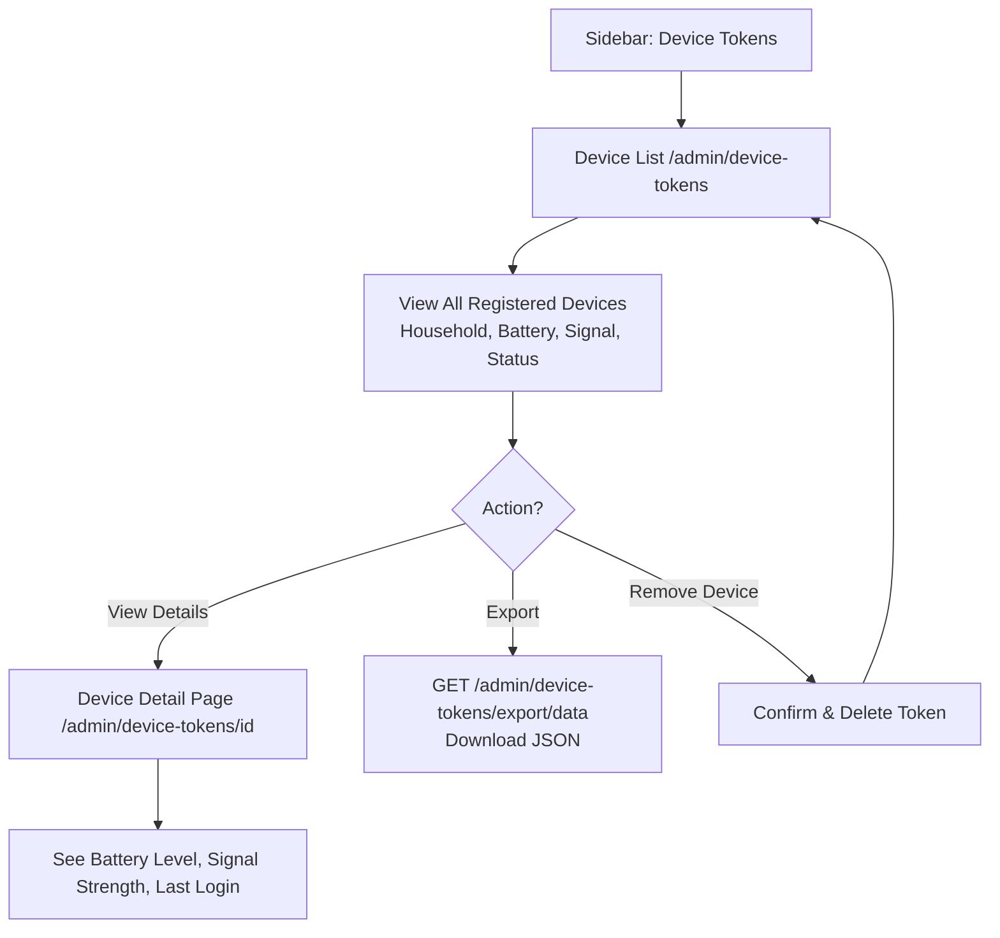
```mermaid
flowchart TD
    A[Sidebar: Device Tokens] --> B[Device List /admin/device-tokens]
    B --> C[View All Registered Devices\nHousehold, Battery, Signal, Status]
    C --> D{Action?}
    D -- View Details --> E[Device Detail Page /admin/device-tokens/id]
    E --> F[See Battery Level, Signal Strength, Last Login]
    D -- Export --> G[GET /admin/device-tokens/export/data\nDownload JSON]
    D -- Remove Device --> H[Confirm & Delete Token]
    H --> B
```

---

### 8.9 Reports UI Flow

```mermaid
flowchart TD
    A[Sidebar: Reports] --> B[Reports Overview /admin/reports]
    B --> C{Report Type?}
    C -- Evacuation --> D[/admin/reports/evacuation\nFilter: Status, Date Range]
    C -- Rescue --> E[/admin/reports/rescue\nFilter: Incident Type, Date]
    C -- Logistics --> F[/admin/reports/logistics\nFilter: Item Type, Status]
    D --> G{API Connected?}
    E --> G
    F --> G
    G -- Yes --> H[Load Report Data from Subsystem API]
    H --> I[Display Report Table]
    G -- No --> J[Show 'Awaiting Integration' Placeholder]
```

---

## 9. Use Case Diagrams

Use cases are organized per functional category.

---

### 9.1 Authentication Use Cases

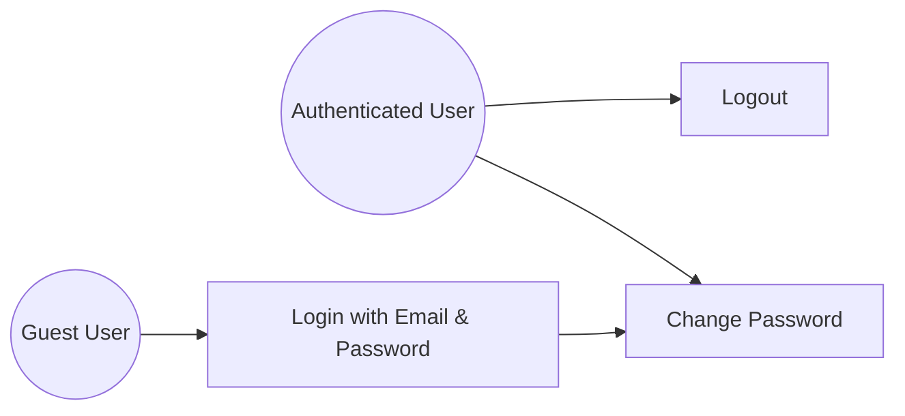
```mermaid
graph LR
    GU((Guest User))
    AU((Authenticated User))

    GU --> UC1[Login with Email & Password]
    AU --> UC2[Logout]
    AU --> UC3[Change Password]
    UC1 --> UC3
```

---

### 9.2 Household Management Use Cases

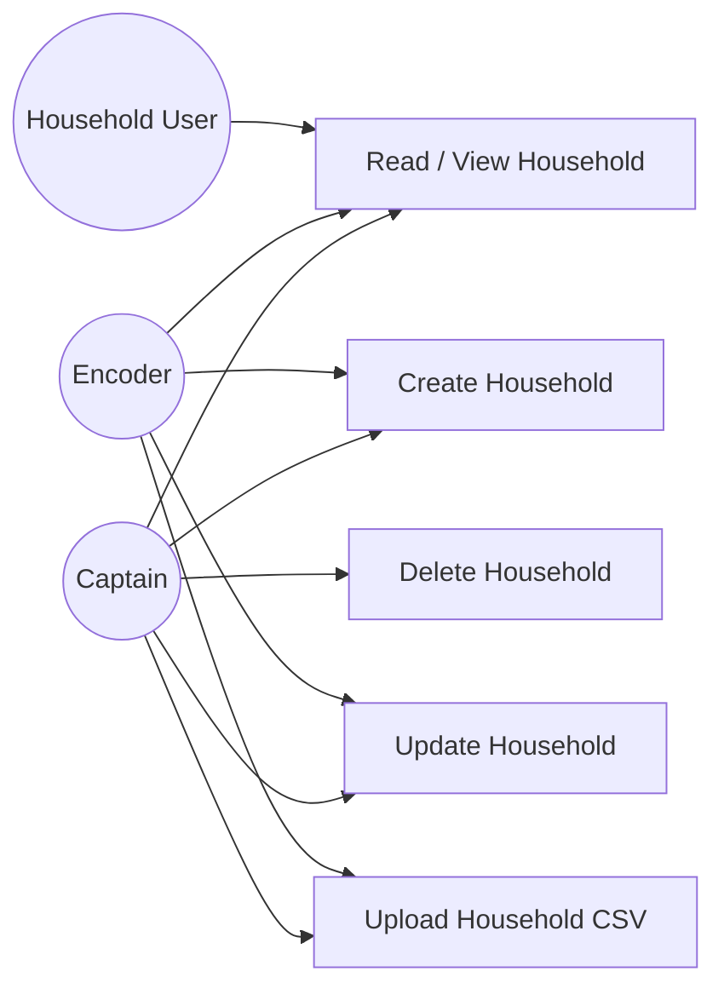
```mermaid
graph LR
    CAP((Captain))
    ENC((Encoder))
    HH((Household User))

    CAP --> UC1[Create Household]
    CAP --> UC2[Read / View Household]
    CAP --> UC3[Update Household]
    CAP --> UC4[Delete Household]
    CAP --> UC5[Upload Household CSV]

    ENC --> UC1
    ENC --> UC2
    ENC --> UC3
    ENC --> UC5

    HH --> UC2
```

---

### 9.3 Member Management Use Cases

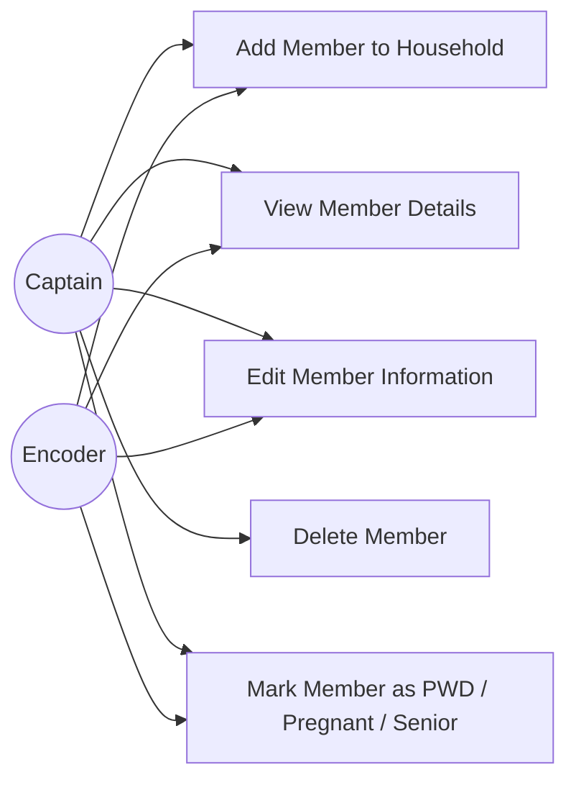
```mermaid
graph LR
    CAP((Captain))
    ENC((Encoder))

    CAP --> UC1[Add Member to Household]
    CAP --> UC2[View Member Details]
    CAP --> UC3[Edit Member Information]
    CAP --> UC4[Delete Member]
    CAP --> UC5[Mark Member as PWD / Pregnant / Senior]

    ENC --> UC1
    ENC --> UC2
    ENC --> UC3
    ENC --> UC5
```

---

### 9.4 Account Management Use Cases

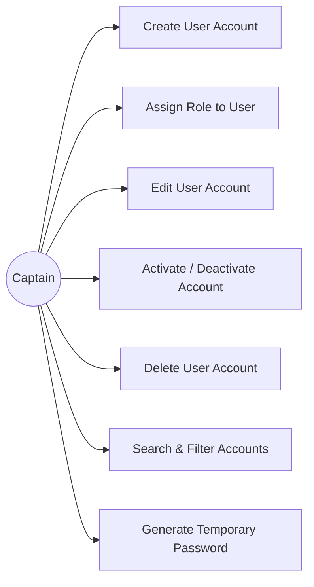
```mermaid
graph LR
    CAP((Captain))

    CAP --> UC1[Create User Account]
    CAP --> UC2[Assign Role to User]
    CAP --> UC3[Edit User Account]
    CAP --> UC4[Activate / Deactivate Account]
    CAP --> UC5[Delete User Account]
    CAP --> UC6[Search & Filter Accounts]
    CAP --> UC7[Generate Temporary Password]
```

---

### 9.5 CSV Import Use Cases

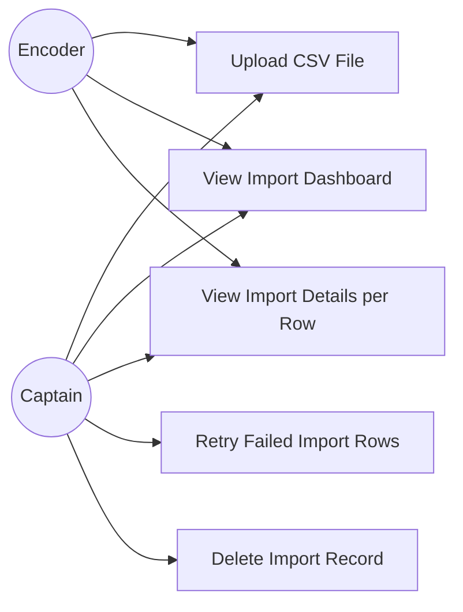
```mermaid
graph LR
    CAP((Captain))
    ENC((Encoder))

    CAP --> UC1[Upload CSV File]
    CAP --> UC2[View Import Dashboard]
    CAP --> UC3[View Import Details per Row]
    CAP --> UC4[Retry Failed Import Rows]
    CAP --> UC5[Delete Import Record]

    ENC --> UC1
    ENC --> UC2
    ENC --> UC3
```

---

### 9.6 Analytics Use Cases

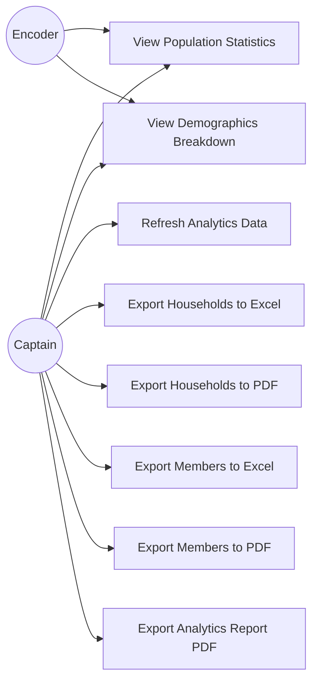
```mermaid
graph LR
    CAP((Captain))
    ENC((Encoder))

    CAP --> UC1[View Population Statistics]
    CAP --> UC2[View Demographics Breakdown]
    CAP --> UC3[Refresh Analytics Data]
    CAP --> UC4[Export Households to Excel]
    CAP --> UC5[Export Households to PDF]
    CAP --> UC6[Export Members to Excel]
    CAP --> UC7[Export Members to PDF]
    CAP --> UC8[Export Analytics Report PDF]

    ENC --> UC1
    ENC --> UC2
```

---

### 9.7 Advanced Search Use Cases

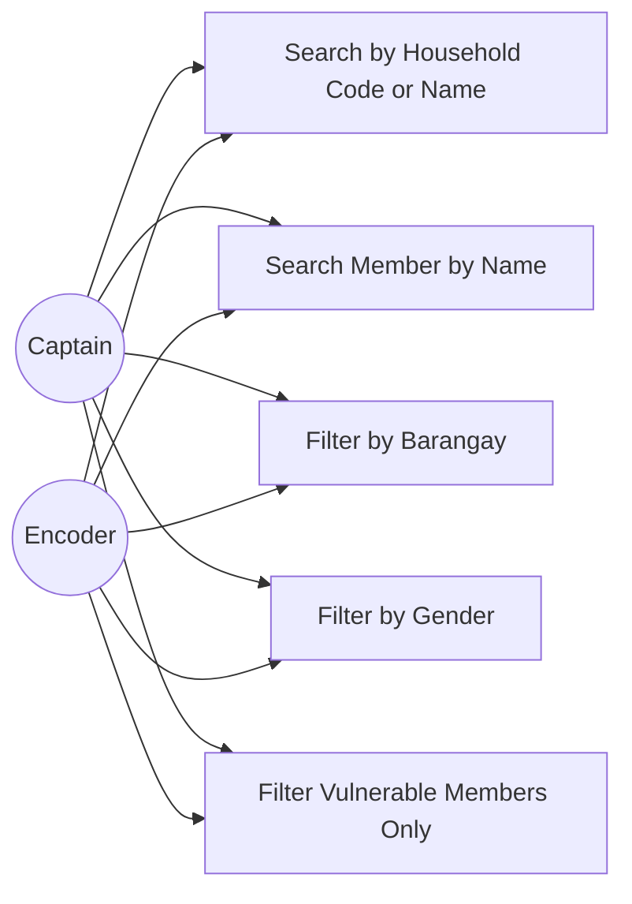
```mermaid
graph LR
    CAP((Captain))
    ENC((Encoder))

    CAP --> UC1[Search by Household Code or Name]
    CAP --> UC2[Search Member by Name]
    CAP --> UC3[Filter by Barangay]
    CAP --> UC4[Filter by Gender]
    CAP --> UC5[Filter Vulnerable Members Only]

    ENC --> UC1
    ENC --> UC2
    ENC --> UC3
    ENC --> UC4
    ENC --> UC5
```

---

### 9.8 Device Token Tracking Use Cases

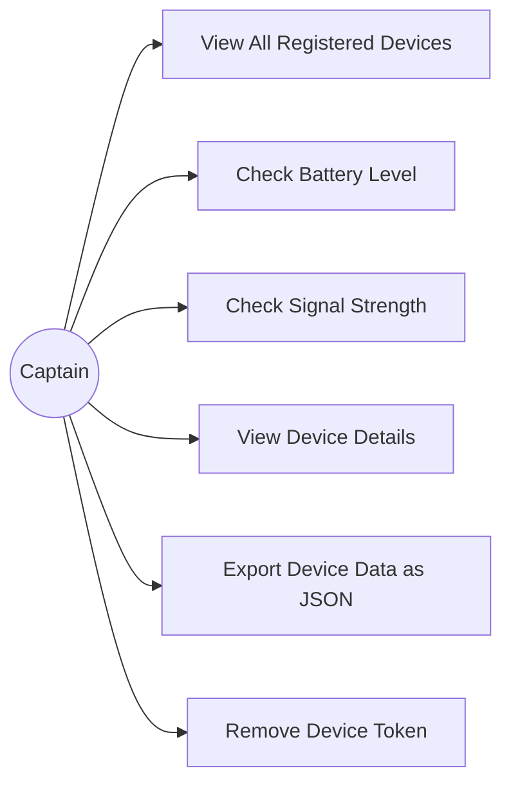
```mermaid
graph LR
    CAP((Captain))

    CAP --> UC1[View All Registered Devices]
    CAP --> UC2[Check Battery Level]
    CAP --> UC3[Check Signal Strength]
    CAP --> UC4[View Device Details]
    CAP --> UC5[Export Device Data as JSON]
    CAP --> UC6[Remove Device Token]
```

---

### 9.9 Reports Use Cases

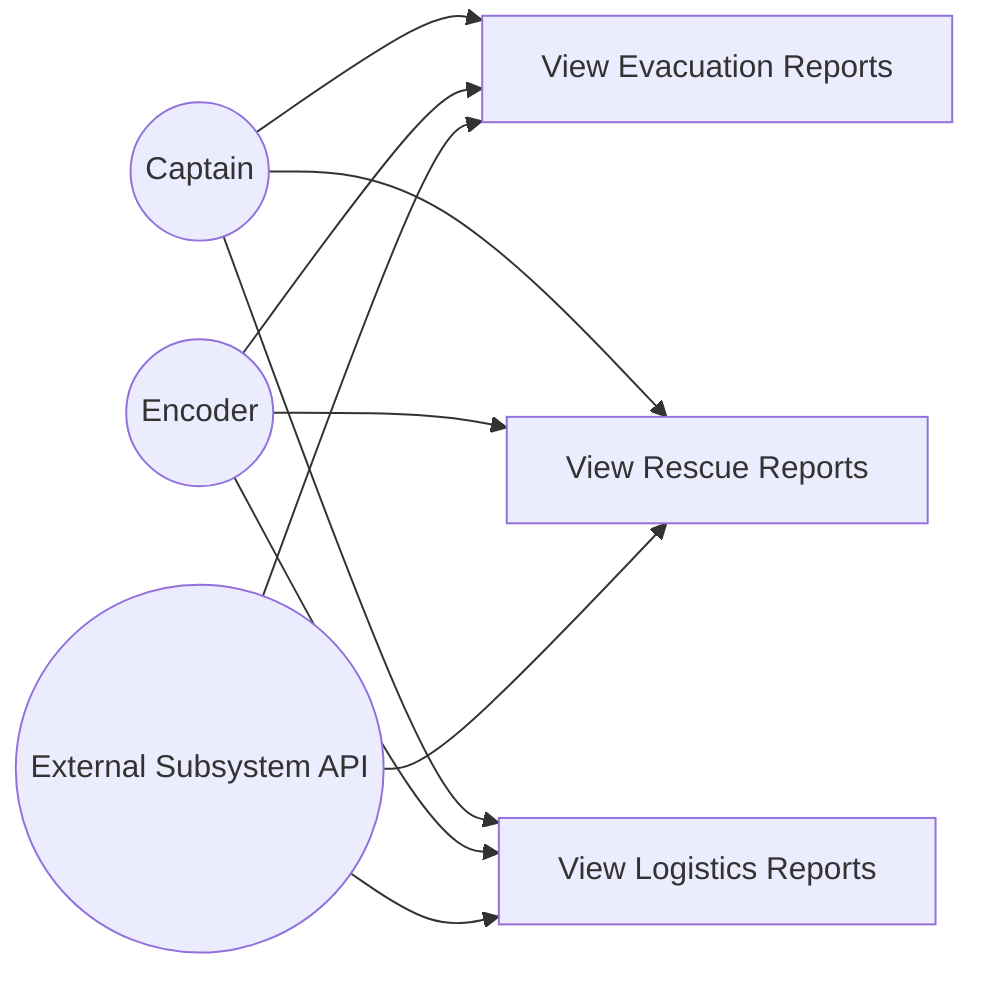
```mermaid
graph LR
    CAP((Captain))
    ENC((Encoder))
    SUB((External Subsystem API))

    CAP --> UC1[View Evacuation Reports]
    CAP --> UC2[View Rescue Reports]
    CAP --> UC3[View Logistics Reports]
    ENC --> UC1
    ENC --> UC2
    ENC --> UC3
    SUB --> UC1
    SUB --> UC2
    SUB --> UC3
```

---

### 9.10 Household Portal Use Cases

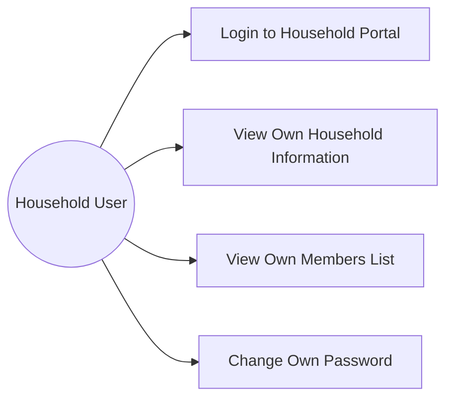
```mermaid
graph LR
    HH((Household User))

    HH --> UC1[Login to Household Portal]
    HH --> UC2[View Own Household Information]
    HH --> UC3[View Own Members List]
    HH --> UC4[Change Own Password]
```

---

## 10. Sequence Diagrams

Each diagram shows the interaction between actors and system components for a key operation.

---

### 10.1 User Login Sequence

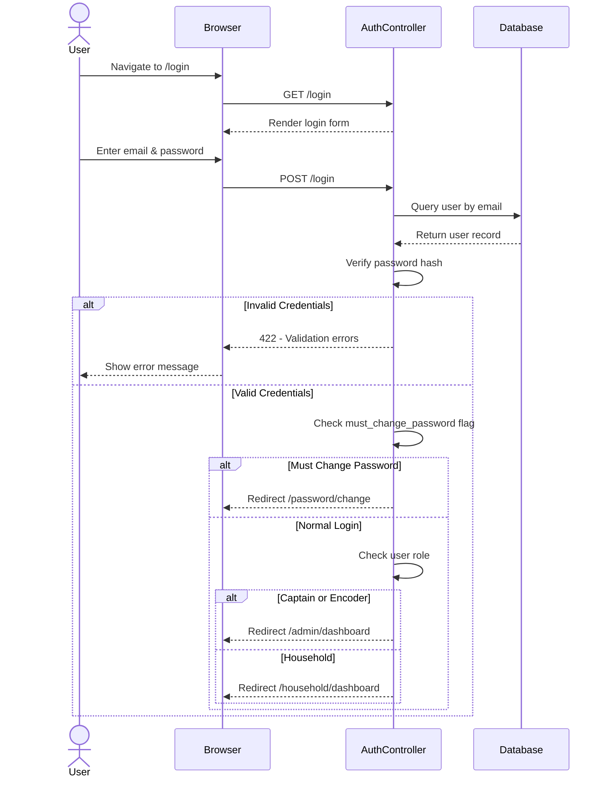
```mermaid
sequenceDiagram
    actor User
    participant Browser
    participant AuthController
    participant DB as Database

    User->>Browser: Navigate to /login
    Browser->>AuthController: GET /login
    AuthController-->>Browser: Render login form
    User->>Browser: Enter email & password
    Browser->>AuthController: POST /login
    AuthController->>DB: Query user by email
    DB-->>AuthController: Return user record
    AuthController->>AuthController: Verify password hash
    alt Invalid Credentials
        AuthController-->>Browser: 422 - Validation errors
        Browser-->>User: Show error message
    else Valid Credentials
        AuthController->>AuthController: Check must_change_password flag
        alt Must Change Password
            AuthController-->>Browser: Redirect /password/change
        else Normal Login
            AuthController->>AuthController: Check user role
            alt Captain or Encoder
                AuthController-->>Browser: Redirect /admin/dashboard
            else Household
                AuthController-->>Browser: Redirect /household/dashboard
            end
        end
    end
```

---

### 10.2 Create Household Sequence

```mermaid
sequenceDiagram
    actor Captain
    participant Browser
    participant HouseholdController
    participant LocationController
    participant DB as Database

    Captain->>Browser: Navigate to /admin/households/create
    Browser->>HouseholdController: GET /admin/households/create
    HouseholdController-->>Browser: Render create form

    Captain->>Browser: Select Region dropdown
    Browser->>LocationController: GET /locations/provinces/{regionId}
    LocationController->>DB: Query provinces by region
    DB-->>LocationController: Province list
    LocationController-->>Browser: JSON province list

    Note over Browser: Cascades: Province → City → Barangay → Sitio

    Captain->>Browser: Fill Household Code, Name, Contact
    Captain->>Browser: Submit form
    Browser->>HouseholdController: POST /admin/households
    HouseholdController->>HouseholdController: Validate input
    alt Validation Fails
        HouseholdController-->>Browser: 422 - Error messages
    else Validation Passes
        HouseholdController->>DB: Create Address record
        HouseholdController->>DB: Create Household record
        DB-->>HouseholdController: Household ID
        HouseholdController-->>Browser: Redirect /admin/households/{id}
        Browser-->>Captain: View household detail page
    end
```

---

### 10.3 Add Member to Household Sequence

```mermaid
sequenceDiagram
    actor Encoder
    participant Browser
    participant ResidentController
    participant DB as Database

    Encoder->>Browser: Click 'Add Member' on Household Detail
    Browser->>ResidentController: GET /admin/residents/{household_id}/create
    ResidentController->>DB: Load household record
    DB-->>ResidentController: Household data
    ResidentController-->>Browser: Render member form

    Encoder->>Browser: Fill member details (name, birth date, sex, relation)
    Encoder->>Browser: Check PWD / Pregnant / Senior flags
    Encoder->>Browser: Submit form
    Browser->>ResidentController: POST /admin/residents/{household_id}
    ResidentController->>ResidentController: Validate all fields
    alt Validation Fails
        ResidentController-->>Browser: 422 - Errors
    else Validation Passes
        ResidentController->>DB: Create Member record
        ResidentController->>DB: Update household member_count
        DB-->>ResidentController: OK
        ResidentController-->>Browser: Redirect to Household Detail
    end
```

---

### 10.4 CSV Bulk Import Sequence

```mermaid
sequenceDiagram
    actor Captain
    participant Browser
    participant CSVController
    participant ImportService
    participant DB as Database

    Captain->>Browser: Navigate to /csv/upload
    Browser->>CSVController: GET /csv/upload
    CSVController-->>Browser: Render upload form

    Captain->>Browser: Select CSV file & Submit
    Browser->>CSVController: POST /csv/upload (multipart/form-data)
    CSVController->>CSVController: Validate file type & size
    CSVController->>DB: Create DataSource record
    CSVController->>DB: Create CsvUpload record
    CSVController->>ImportService: processFile(csvUpload)

    loop For each CSV row
        ImportService->>DB: Find or validate Barangay
        ImportService->>DB: Create Address
        ImportService->>DB: Create Household
        ImportService->>DB: Create Member(s)
        ImportService->>DB: Create User Account (temp password)
        alt Row Success
            ImportService->>DB: Log ImportLog status=success
        else Row Failure
            ImportService->>DB: Log ImportLog status=failed + error_message
        end
    end

    ImportService->>DB: Update CsvUpload (total/success/failed counts)
    CSVController-->>Browser: Redirect /admin/csv-import with summary
```

---

### 10.5 Advanced Search Sequence

```mermaid
sequenceDiagram
    actor Encoder
    participant Browser
    participant SearchController
    participant DB as Database

    Encoder->>Browser: Navigate to /admin/search
    Browser->>SearchController: GET /admin/search
    SearchController-->>Browser: Render search form

    Encoder->>Browser: Enter query + apply filters (barangay, gender)
    Browser->>SearchController: GET /admin/search/results?q=...&barangay=...
    SearchController->>DB: Query Households WHERE name/code LIKE %query%
    SearchController->>DB: Query Members WHERE first_name/last_name LIKE %query%
    DB-->>SearchController: Matching households
    DB-->>SearchController: Matching members

    SearchController->>SearchController: Merge & deduplicate results
    SearchController-->>Browser: Render results page (up to 20 records)
    Browser-->>Encoder: Display households + members table
```

---

### 10.6 Data Export Sequence

```mermaid
sequenceDiagram
    actor Captain
    participant Browser
    participant ExportController
    participant ExcelLib as Maatwebsite/Excel
    participant PDFLib as DomPDF
    participant DB as Database

    Captain->>Browser: Click 'Export Households to Excel'
    Browser->>ExportController: GET /admin/export/households/excel
    ExportController->>DB: SELECT all households with address & member count
    DB-->>ExportController: Dataset
    ExportController->>ExcelLib: Generate xlsx from dataset
    ExcelLib-->>ExportController: Excel file
    ExportController-->>Browser: Download households_YYYY-MM-DD.xlsx

    Captain->>Browser: Click 'Export Households to PDF'
    Browser->>ExportController: GET /admin/export/households/pdf
    ExportController->>DB: SELECT households
    DB-->>ExportController: Dataset
    ExportController->>PDFLib: Render PDF from Blade view
    PDFLib-->>ExportController: PDF file
    ExportController-->>Browser: Download households_YYYY-MM-DD.pdf
```

---

### 10.7 Account Creation Sequence

```mermaid
sequenceDiagram
    actor Captain
    participant Browser
    participant AccountController
    participant DB as Database

    Captain->>Browser: Navigate to /admin/accounts/create
    Browser->>AccountController: GET /admin/accounts/create
    AccountController->>DB: Load roles & households
    DB-->>AccountController: Roles, Households
    AccountController-->>Browser: Render account create form

    Captain->>Browser: Fill name, email, username, password, role
    Captain->>Browser: Submit form
    Browser->>AccountController: POST /admin/accounts
    AccountController->>AccountController: Validate input (unique email, strong password)
    alt Validation Fails
        AccountController-->>Browser: 422 Errors
    else Validation Passes
        AccountController->>DB: Create User record
        AccountController->>DB: Assign Role ID
        alt Household Role
            AccountController->>DB: Link to Household record
        end
        DB-->>AccountController: User created
        AccountController-->>Browser: Redirect /admin/accounts with success flash
    end
```

---

### 10.8 Device Token Tracking Sequence

```mermaid
sequenceDiagram
    actor MobileApp
    participant TokenAPI
    participant DeviceController
    participant DB as Database
    actor Captain
    participant Browser

    MobileApp->>TokenAPI: POST /api/device-tokens (register token)
    TokenAPI->>DB: Upsert DeviceToken record
    DB-->>TokenAPI: OK
    TokenAPI-->>MobileApp: 201 Created

    MobileApp->>TokenAPI: PUT /api/device-tokens/{id} (update battery/signal)
    TokenAPI->>DB: Update battery_level, signal_strength, last_seen_at
    DB-->>TokenAPI: OK

    Captain->>Browser: Navigate to /admin/device-tokens
    Browser->>DeviceController: GET /admin/device-tokens
    DeviceController->>DB: SELECT all device tokens with household
    DB-->>DeviceController: Device list
    DeviceController-->>Browser: Render device list with status indicators

    Captain->>Browser: Click device for detail
    Browser->>DeviceController: GET /admin/device-tokens/{id}
    DeviceController->>DB: Load device + household
    DB-->>DeviceController: Device detail
    DeviceController-->>Browser: Render device detail page
```

---

## 11. Data Architecture Diagrams

Each diagram is organized per use case category showing the relevant entities and their relationships.

---

### 11.1 Authentication & User Data Architecture

```mermaid
erDiagram
    ROLE {
        uuid id PK
        varchar name
        timestamp created_at
        timestamp updated_at
    }
    USER {
        uuid id PK
        varchar name
        varchar username
        varchar email
        varchar password
        varchar contact_number
        boolean is_active
        uuid role_id FK
        uuid household_id FK
        boolean must_change_password
        varchar temp_password
        timestamp created_at
        timestamp updated_at
    }
    PERSONAL_ACCESS_TOKENS {
        bigint id PK
        string tokenable_type
        uuid tokenable_id
        string name
        string token
        timestamp last_used_at
        timestamp created_at
    }

    ROLE ||--o{ USER : "has"
    USER ||--o| PERSONAL_ACCESS_TOKENS : "owns"
```

---

### 11.2 Household & Member Data Architecture

```mermaid
erDiagram
    HOUSEHOLD {
        uuid id PK
        varchar household_code
        varchar household_name
        varchar email
        int member_count
        uuid address_id FK
        varchar contact_number
        varchar emergency_contact
        uuid created_by FK
        timestamp created_at
        timestamp updated_at
        timestamp deleted_at
    }
    MEMBER {
        uuid id PK
        uuid household_id FK
        varchar first_name
        varchar middle_name
        varchar last_name
        date birth_date
        enum sex
        varchar gender
        int age
        varchar relation
        varchar civil_status
        varchar education_level
        varchar occupation
        boolean is_pwd
        boolean is_pregnant
        boolean is_senior
        varchar special_needs
        timestamp created_at
        timestamp updated_at
        timestamp deleted_at
    }
    ADDRESS {
        uuid id PK
        varchar street
        varchar purok_sitio
        varchar house_number
        varchar zip_code
        varchar full_address
        uuid barangay_id FK
        varchar barangay_name
        timestamp created_at
        timestamp updated_at
        timestamp deleted_at
    }
    USER {
        uuid id PK
        varchar name
        varchar email
    }

    ADDRESS ||--o{ HOUSEHOLD : "located at"
    HOUSEHOLD ||--o{ MEMBER : "contains"
    USER ||--o{ HOUSEHOLD : "created"
```

---

### 11.3 Location Hierarchy Data Architecture

```mermaid
erDiagram
    REGION {
        uuid id PK
        varchar name
        varchar code
        json metadata
    }
    PROVINCE {
        uuid id PK
        uuid region_id FK
        varchar name
        varchar code
        json metadata
    }
    CITY {
        uuid id PK
        uuid province_id FK
        varchar name
        varchar code
        json metadata
    }
    BARANGAY {
        uuid id PK
        uuid city_id FK
        varchar name
        varchar code
        json metadata
    }
    SITIO {
        uuid id PK
        uuid barangay_id FK
        varchar name
        json metadata
    }
    ADDRESS {
        uuid id PK
        uuid barangay_id FK
        varchar street
        varchar purok_sitio
    }

    REGION ||--o{ PROVINCE : "contains"
    PROVINCE ||--o{ CITY : "contains"
    CITY ||--o{ BARANGAY : "contains"
    BARANGAY ||--o{ SITIO : "contains"
    BARANGAY ||--o{ ADDRESS : "referenced by"
```

---

### 11.4 CSV Import Data Architecture

```mermaid
erDiagram
    DATA_SOURCE {
        uuid id PK
        varchar type
        uuid uploaded_by FK
        timestamp created_at
        timestamp updated_at
    }
    CSV_UPLOAD {
        uuid id PK
        uuid data_source_id FK
        varchar file_name
        int total_records
        int successful_records
        int failed_records
        timestamp created_at
        timestamp updated_at
    }
    IMPORT_LOG {
        uuid id PK
        uuid data_source_id FK
        int row_number
        varchar status
        text error_message
        timestamp created_at
        timestamp updated_at
    }
    USER {
        uuid id PK
        varchar name
        varchar email
    }

    USER ||--o{ DATA_SOURCE : "uploads"
    DATA_SOURCE ||--o{ CSV_UPLOAD : "tracks"
    DATA_SOURCE ||--o{ IMPORT_LOG : "logs"
```

---

### 11.5 Analytics Data Architecture

```mermaid
erDiagram
    ANALYTIC {
        uuid id PK
        uuid barangay_id FK
        varchar purok_sitio
        date record_period
        int total_households
        int total_population
        int total_males
        int total_females
        int total_pwd
        int total_seniors
        int total_children
        int total_adults
        int total_pregnant
        int total_evacuees
        timestamp created_at
        timestamp updated_at
    }
    BARANGAY {
        uuid id PK
        varchar name
        varchar code
    }
    HOUSEHOLD {
        uuid id PK
        varchar household_code
        uuid address_id FK
    }
    MEMBER {
        uuid id PK
        uuid household_id FK
        boolean is_pwd
        boolean is_pregnant
        boolean is_senior
        int age
        enum sex
    }

    BARANGAY ||--o{ ANALYTIC : "aggregated into"
    HOUSEHOLD ||--o{ MEMBER : "contains"
    BARANGAY ||--o{ HOUSEHOLD : "has"
```

---

### 11.6 Device Token Data Architecture

```mermaid
erDiagram
    DEVICE_TOKEN {
        uuid id PK
        uuid household_id FK
        varchar player_id
        int battery_level
        int signal_strength
        varchar status
        timestamp last_seen_at
        timestamp created_at
        timestamp updated_at
    }
    HOUSEHOLD {
        uuid id PK
        varchar household_code
        varchar household_name
    }
    USER {
        uuid id PK
        uuid household_id FK
        varchar name
    }

    HOUSEHOLD ||--o| DEVICE_TOKEN : "registered"
    HOUSEHOLD ||--o| USER : "assigned to"
```

---

### 11.7 Full System Entity Relationship Overview

```mermaid
erDiagram
    ROLE ||--o{ USER : "assigned"
    USER ||--o{ HOUSEHOLD : "creates"
    USER ||--o| HOUSEHOLD : "linked to"
    USER ||--o{ DATA_SOURCE : "uploads"
    HOUSEHOLD ||--o{ MEMBER : "contains"
    HOUSEHOLD ||--|| ADDRESS : "has"
    HOUSEHOLD ||--o| DEVICE_TOKEN : "has"
    ADDRESS ||--|| BARANGAY : "belongs to"
    BARANGAY ||--|| CITY : "in"
    CITY ||--|| PROVINCE : "in"
    PROVINCE ||--|| REGION : "in"
    BARANGAY ||--o{ SITIO : "subdivided"
    BARANGAY ||--o{ ANALYTIC : "tracks"
    DATA_SOURCE ||--o{ CSV_UPLOAD : "tracks"
    DATA_SOURCE ||--o{ IMPORT_LOG : "logs"
```

---

## 12. API Reference

### Authentication

All API endpoints use Laravel Sanctum Bearer token authentication:

```
Authorization: Bearer {token}
```

### Location Dropdown Endpoints (Internal)

| Method | Endpoint | Description |
|---|---|---|
| GET | `/locations/regions` | All regions |
| GET | `/locations/provinces/{regionId}` | Provinces by region |
| GET | `/locations/cities/{provinceId}` | Cities by province |
| GET | `/locations/barangays/{cityId}` | Barangays by city |
| GET | `/locations/sitios/{barangayId}` | Sitios by barangay |

### Admin Web Routes

| Method | Endpoint | Description | Role |
|---|---|---|---|
| GET | `/admin/dashboard` | Admin dashboard | Captain, Encoder |
| GET/POST | `/admin/households` | List / Create household | Captain, Encoder |
| GET/PUT/DELETE | `/admin/households/{id}` | Show / Update / Delete | Captain (delete) |
| GET/POST | `/admin/residents/{hh_id}` | Add member to household | Captain, Encoder |
| GET/PUT/DELETE | `/admin/residents/{id}` | Edit / Delete member | Captain (delete) |
| GET/POST | `/admin/accounts` | List / Create accounts | Captain |
| GET | `/admin/analytics` | Analytics dashboard | Captain, Encoder |
| GET | `/admin/search` | Advanced search form | Captain, Encoder |
| GET | `/admin/search/results` | Search results | Captain, Encoder |
| GET | `/admin/csv-import` | Import dashboard | Captain, Encoder |
| GET | `/admin/device-tokens` | Device list | Captain |
| GET | `/admin/export/households/excel` | Export Excel | Captain |
| GET | `/admin/export/households/pdf` | Export PDF | Captain |
| GET | `/admin/export/members/excel` | Members Excel | Captain |
| GET | `/admin/export/members/pdf` | Members PDF | Captain |
| GET | `/admin/export/analytics` | Analytics PDF | Captain |
| GET | `/admin/reports/evacuation` | Evacuation reports | Captain, Encoder |
| GET | `/admin/reports/rescue` | Rescue reports | Captain, Encoder |
| GET | `/admin/reports/logistics` | Logistics reports | Captain, Encoder |
| GET/POST | `/admin/settings` | Settings & API tokens | Captain |

---

## 13. Troubleshooting

### Routes Not Found (404)

```bash
php artisan route:cache --force
php artisan route:clear
```

### Unauthorized / Redirected on Admin Access

Verify the user's role in the database and ensure `AdminMiddleware` is applied:

```bash
php artisan tinker
# Check user role:
\App\Models\User::with('role')->find('user-uuid-here');
```

### Location Dropdowns Not Loading

1. Check API routes exist: `php artisan route:list | grep location`
2. Verify data exists: `php artisan tinker` → `\App\Models\Region::count();`
3. Check browser console for AJAX errors

### Database Migration Errors

```bash
php artisan migrate:status
php artisan migrate --step
```

### CSS/JS Not Loading

```bash
php artisan storage:link
npm run build
```

### Export Files Not Downloading

Ensure packages are installed and storage is writable:

```bash
composer require maatwebsite/excel barryvdh/laravel-pdf
chmod -R 775 storage/
chmod -R 775 bootstrap/cache/
```

### Clear All Caches

```bash
php artisan optimize:clear
```

---

## License

This project is a Capstone Project developed for academic purposes.

**Framework:** Laravel 13 | **Language:** PHP 8.3 | **Database:** MySQL  
**Version:** 1.0 | **Status:** Functional & Ready for Integration  
**Last Updated:** July 2026
